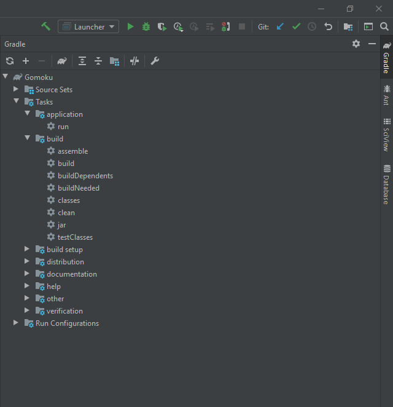
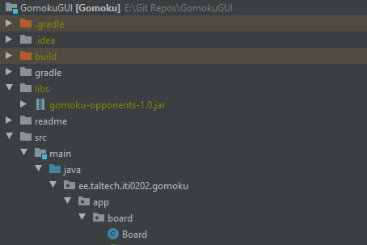

# GomokuGUI
_Gomoku UI_


## How to run via terminal
Clone project
```bash
git clone https://github.com/kilpkonn/GomokuGUI.git
```
Copy opponent jar files to `/libs`
```bash
cp <...>/gomoku-opponents-1.0.jar ./libs/gomoku-opponents-1.0.jar
```
(Re)Build gradle project
```bash
./gradlew build
```
Run with
```bash
./gradlew run
```
 
## How to run in IntelliJ for dummies
Clone project...  
If IntelliJ wants to import gradle project, click "yes".    
Intellij has a gradle window on the right:
  
  
Copy `gomoku-opponents-1.0.jar` to `/libs` directory.   
Should look something like this:  
  
  
You might need to re-sync/import gradle project again. (Use refresh icon on gradle tab)  
To run program simply select run task from gradle tab.

## Make your own strategy:  
* Make sure to place it under `ee.taltech.iti0202.gomoku.app.player.strategy`
* Make sure to extend `ee.taltech.iti0202.gomoku.app.player.strategy.Strategy`

## How to keep Gomoku GUI up to date, but easily push to own repo
```bash
# After having cloned gomoku...
# View existing repos
git remote -v
# Set your repo as new origin
git remote set-url origin https://gitlab.cs.ttu.ee/<uniid>/<repo>.git
# Validate / you can trry to push aswell
git remote -v

# Set upstream
git remote add upstream https://github.com/kilpkonn/GomokuGUI.git
# Validate
git remote -v
# To fetch and merge changes from upstream
git pull upstream
``` 

## If Gomoku is broken...
* **You can create issues here on github**
* **Pull requests are also welcome for improvements!**
